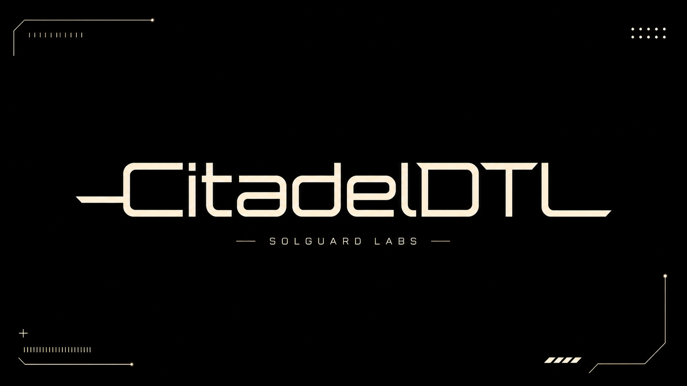
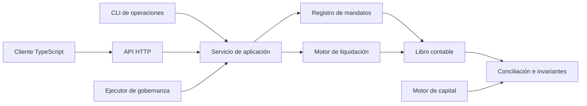
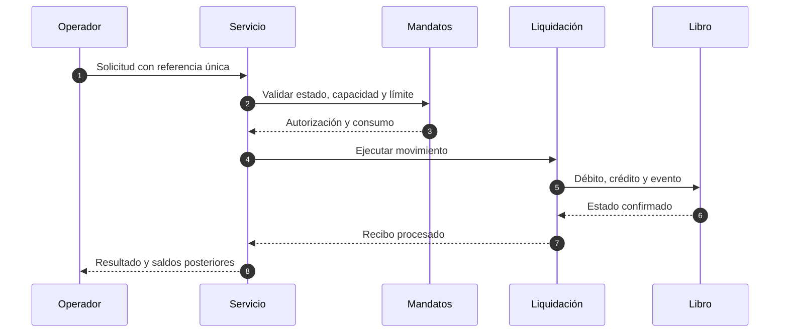
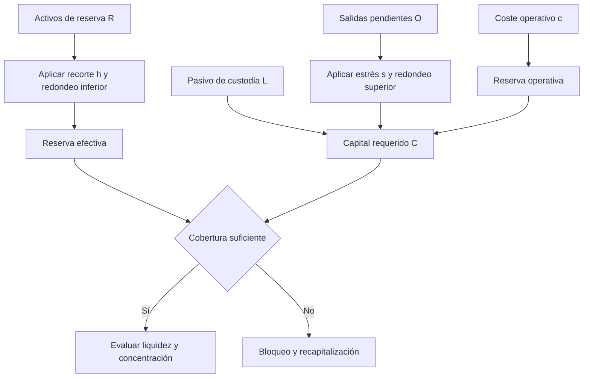

# CitadelDTL



[](https://github.com/SolguardLabs/CitadelDTL/actions/workflows/ci.yml)
[](https://github.com/SolguardLabs/CitadelDTL/actions/workflows/release-integrity.yml)
[](https://go.dev/)
[](https://nodejs.org/)

CitadelDTL es una infraestructura de custodia institucional y liquidación programable. Mantiene reservas segregadas, cuentas con responsabilidades diferenciadas, mandatos con límites acumulados y un registro determinista de cada movimiento. El núcleo está escrito en Go y el cliente de integración en TypeScript usa enteros arbitrarios para conservar la precisión monetaria.

## Alcance funcional

- Libro contable por cuenta, activo y segregación, con diario inmutable en memoria.
- Mandatos institucionales con límites diarios, de retirada y de liquidación.
- Cuentas delegadas y operativas con capacidades explícitas.
- Depósitos, transferencias internas, retiradas, liquidaciones y recibos.
- Conciliación de pasivos de custodia frente a reservas segregadas.
- Modelo de capital bajo recortes, estrés de salidas y coste operativo.
- Gobernanza con identificadores SHA-256, quórum, espera, caducidad y predecesores.
- API HTTP de lectura y auditoría, CLI de escenarios y cliente TypeScript.

## Arquitectura



El libro contable es la fuente de verdad para cuentas, saldos, reservas y eventos. El registro de mandatos decide las capacidades y consume límites; el motor de liquidación realiza los débitos y emite recibos. La auditoría recompone el estado desde esas fuentes y presenta incidencias accionables.



### Dominios

| Dominio            | Responsabilidad                                        | Propiedad crítica                       |
| ------------------ | ------------------------------------------------------ | --------------------------------------- |
| `domain`           | Tipos monetarios, cuentas, mandatos, eventos y errores | Cantidades enteras y estados validados  |
| `ledger`           | Saldos, segregaciones, reservas y diario               | Conservación por activo                 |
| `mandate`          | Alta, jerarquía, límites y capacidades                 | Consumo acumulado por época             |
| `settlement`       | Movimientos externos y recibos                         | Débito y registro coordinados           |
| `audit`            | Conciliación posterior                                 | Evidencia ordenada y reproducible       |
| `risk`             | Capital, liquidez y concentración                      | Aritmética entera con redondeo dirigido |
| `governance`       | Cambios diferidos y aprobaciones                       | Identidad canónica y ejecución única    |
| `api` / `scenario` | Adaptadores HTTP y CLI                                 | Respuesta JSON estable                  |

## Modelo económico

Para cada segregación \(i\), CitadelDTL calcula:

\[
R_i^{ef}=\left\lfloor R_i\frac{10^6-h_i}{10^6}\right\rfloor
\]

\[
O_i^{stress}=\left\lceil O_i\frac{10^6+s_i}{10^6}\right\rceil,\qquad
C_i=L_i+O_i^{stress}+\left\lceil L_i\frac{c_i}{10^6}\right\rceil
\]

La cobertura es \(R_i^{ef}/C_i\). La concentración agregada usa el índice de Herfindahl-Hirschman sobre los pasivos de custodia, expresado también en partes por millón. Todos los productos intermedios en Go usan `math/big`; los resultados públicos siguen siendo `uint64` y fallan de forma cerrada si no caben.



Un ejemplo con pasivo `1_000`, reservas `900`, recorte del `10 %`, salidas `100`, estrés del `50 %` y coste operativo del `1 %` produce reserva efectiva `810`, capital requerido `1_160` y déficit `350`. Los detalles y escenarios de cartera están en [Modelo económico](./docs/02-modelo-economico.md).

## Inicio rápido

Requisitos:

- Go `1.22.12`.
- Node.js `24` y npm compatible con el archivo de bloqueo.

```bash
npm ci
npm run ci
```

Listar y ejecutar escenarios deterministas:

```bash
go run ./cmd/citadeldtl list
go run ./cmd/citadeldtl run tests/fixtures/mandate_allocation.json
go run ./cmd/citadeldtl run tests/fixtures/settlement_audit.json
```

Arrancar la API local:

```bash
go run ./cmd/citadeldtl serve --address 127.0.0.1:8080
```

### Cliente TypeScript

```ts
import { CitadelClient } from "./sdk/citadelClient.ts";

const client = new CitadelClient("https://custody.example/api");
const snapshot = await client.snapshot();

await client.transfer(
  {
    from: "operations-eu",
    to: "settlement-usdc",
    asset: "USDC",
    amount: 25_000n,
    reference: "settlement-2026-08-001",
  },
  { idempotencyKey: "idem-settlement-2026-08-001" },
);
```

El cliente exige HTTPS fuera de `localhost`, desactiva redirecciones, limita el tamaño de respuesta y serializa cantidades `bigint` como cadenas decimales. Consulte [API y SDK](./docs/04-api-y-sdk.md) antes de integrar operaciones de escritura.

## Validación

`npm run ci` ejecuta el mismo contrato que GitHub Actions:

1. Prettier y `gofmt` sin cambios pendientes.
2. Comprobación estricta de TypeScript.
3. Pruebas Go y TypeScript.
4. Compilación de todos los paquetes Go.
5. Umbral mínimo de implementación.
6. Integridad documental, terminología pública, diagramas y banner.

La matriz oficial valida Ubuntu y Windows. La rama `production`, la etiqueta anotada y el release deben resolver al mismo commit que `main`; otro workflow comprueba esa relación.

## Documentación

- [Arquitectura y límites de confianza](./docs/01-arquitectura.md)
- [Modelo económico y pruebas de estrés](./docs/02-modelo-economico.md)
- [Seguridad operativa](./docs/03-seguridad-operativa.md)
- [API y SDK](./docs/04-api-y-sdk.md)
- [Operación y recuperación](./docs/05-operacion.md)
- [Gobernanza y gestión de cambios](./docs/06-gobernanza.md)
- [Observabilidad y conciliación](./docs/07-observabilidad.md)

## Versionado

Se usa SemVer. `v1.0.0` define el primer contrato estable del motor, el formato de escenarios, el cliente y las políticas operativas. Los cambios incompatibles requieren una versión mayor y un plan de migración documentado.

La política de comunicación y respuesta está en [SECURITY.md](./SECURITY.md). El software se distribuye bajo los términos de [LICENSE](./LICENSE).
