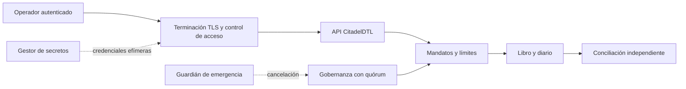
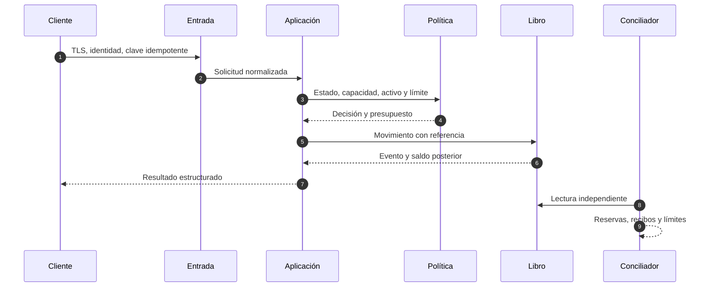

# Política de seguridad

CitadelDTL procesa estados de custodia y decisiones de liquidación. La seguridad se basa en separación de funciones, referencias idempotentes, límites cuantitativos, conciliación independiente y cambios diferidos. Ningún control aislado sustituye la revisión de conjunto.

## Versiones mantenidas

| Versión   | Estado       | Actualizaciones de seguridad |
| --------- | ------------ | ---------------------------- |
| `1.x`     | Mantenida    | Sí                           |
| `< 1.0.0` | No mantenida | No                           |

Las correcciones se publican sobre la última versión menor mantenida. Una corrección que altere formatos, redondeos o estados incluye guía de migración.

## Límites de confianza

El proxy de entrada autentica identidades y aplica límites de solicitud. CitadelDTL valida otra vez el formato, el estado de cuenta y el presupuesto del mandato. El sistema de conciliación debe usar una identidad de solo lectura distinta de la identidad operativa.

## Propiedades que deben preservarse

- La suma de débitos y créditos internos por activo es conservativa.
- Un recibo procesado corresponde a un único movimiento y referencia.
- Ningún saldo disponible, reservado o segregado puede ser negativo.
- El consumo de mandato nunca se contabiliza fuera de su época.
- Los cambios de parámetros quedan ligados a red, destino, método, carga, predecesor, sal y época.
- Las cantidades se transmiten como enteros decimales; no se aceptan números de coma flotante.
- Los informes de conciliación son reproducibles desde el snapshot y el diario.

## Defensa en profundidad

### Controles de despliegue

1. Fijar dependencias con `npm ci` y la versión exacta de Go.
2. Ejecutar `npm run ci` en Ubuntu y Windows.
3. Exigir revisión sobre dominios financieros y workflows mediante `CODEOWNERS`.
4. Desplegar desde una etiqueta anotada que resuelva al commit aprobado de `main` y `production`.
5. Verificar digest del artefacto, identidad de firma y configuración efectiva antes de promover tráfico.
6. Mantener secretos fuera del repositorio y rotarlos tras cualquier exposición.

### Configuración mínima

- TLS 1.3 en el borde y TLS 1.2 solo para compatibilidad controlada.
- Autenticación de servicio a servicio con identidades de corta duración.
- Reloj sincronizado y épocas monotónicas.
- Límites por identidad, cuenta y activo.
- Registro de referencia, actor, decisión, recibo y correlación.
- Copias del diario con retención inmutable y acceso de solo lectura.

## Comunicación privada

Use la pestaña **Security** del repositorio y seleccione **Report a security advisory**. No incluya secretos, datos personales, credenciales ni información de terceros. Un informe útil contiene:

- versión y commit observados;
- precondiciones y componente afectado;
- secuencia mínima reproducible con datos sintéticos;
- propiedad económica o de autorización que deja de cumplirse;
- impacto máximo razonable y condiciones que lo limitan;
- propuesta de mitigación, si existe.

No abra una incidencia pública con detalles operativos antes de que exista una corrección coordinada.

## Tiempos objetivo

| Fase                    |                              Objetivo |
| ----------------------- | ------------------------------------: |
| Acuse de recibo         |                     2 días laborables |
| Clasificación inicial   |                     5 días laborables |
| Plan de contención      | 7 días laborables para severidad alta |
| Actualización de estado |           Cada 7 días hasta el cierre |

Los tiempos son objetivos de operación y pueden variar si el análisis requiere coordinación con dependencias o infraestructuras externas.

## Respuesta a incidentes

Ante una señal material: preservar evidencia, detener promociones, revocar identidades afectadas, comparar reservas con pasivos, aislar la ruta operativa y activar la gobernanza de emergencia. La recuperación exige reconstruir saldos, límites, recibos y referencias antes de reabrir escritura. El procedimiento detallado está en [Operación y recuperación](./docs/05-operacion.md).
