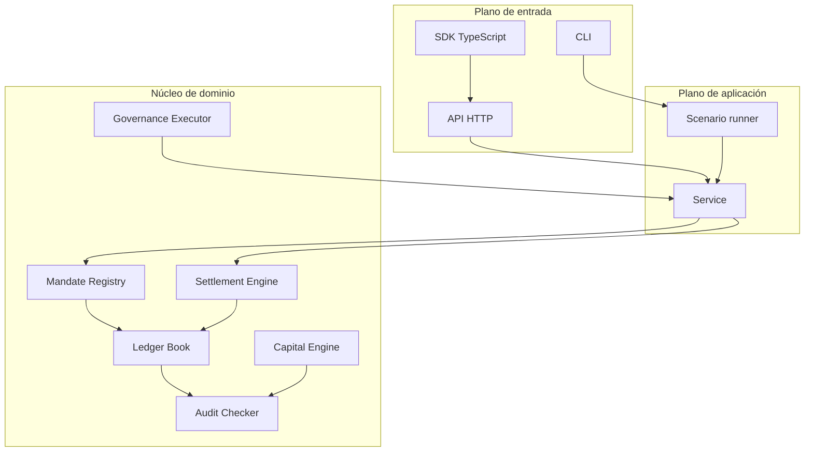
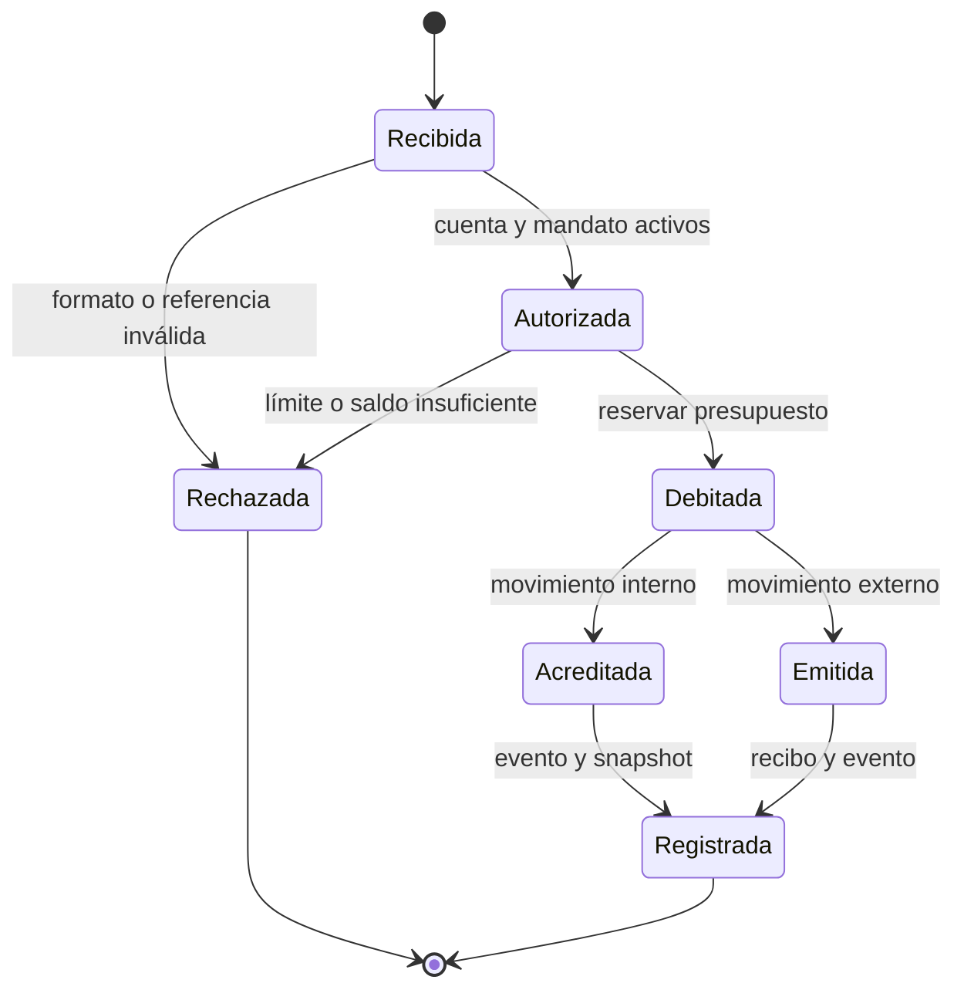

# Arquitectura y límites de confianza

## Objetivo

CitadelDTL separa la decisión de autorización, la mutación contable y la verificación posterior. Esta división permite razonar sobre cada transición económica, repetir una conciliación y atribuir una decisión a su política vigente.

## Vista de componentes

### Responsabilidades

`src/domain` define el vocabulario estable: identificadores nominales, activos, cantidades, estados, recibos y errores. No conoce transporte ni almacenamiento externo.

`src/ledger` conserva cuentas, saldos y eventos. Su responsabilidad es aplicar débitos y créditos válidos sin decidir por qué un actor puede solicitarlos.

`src/mandate` administra la relación entre cuenta institucional, delegada y operativa, además del consumo de límites. Su decisión se expresa mediante errores de dominio con razón estable.

`src/settlement` coordina autorización, movimiento y recibo para operaciones que cruzan el perímetro de custodia.

`src/audit` no autoriza operaciones. Lee el estado y produce observaciones ordenadas, adecuadas para conciliación y alertado.

`src/risk` calcula suficiencia de capital, liquidez, vencimiento y concentración sin depender del libro. Esto permite comparar el cálculo operativo con un cálculo independiente.

`src/governance` modela la cola de cambios. El identificador de cada operación liga todos los campos relevantes y evita que una aprobación se reutilice para otra red, destino o carga.

## Transición contable

Una transición económica debe producir un resultado terminal. La referencia permite reconocer reintentos en adaptadores persistentes; el libro conserva la secuencia de eventos y el recibo conserva el destino externo.

## Modelo de cuentas

| Tipo          | Finalidad                         | Salida habitual              | Segregación               |
| ------------- | --------------------------------- | ---------------------------- | ------------------------- |
| Institucional | Titular económico                 | Directa bajo política        | Obligatoria para custodia |
| Delegada      | Presupuesto otorgado              | Según capacidad configurada  | Heredada del titular      |
| Operativa     | Ejecución diaria                  | Según capacidad de rol       | Heredada del mandato      |
| Reserva       | Contrapartida de custodia         | Solo ajuste controlado       | Identificador propio      |
| Liquidación   | Compensación con contrapartes     | Flujo de settlement          | Según circuito            |
| Externa       | Representación de fondos emitidos | No reingresa automáticamente | Fuera del perímetro       |

## Límites de confianza

1. **Cliente a entrada:** TLS, autenticación, tamaño, método y frecuencia.
2. **Entrada a aplicación:** esquema, normalización, clave idempotente y contexto de identidad.
3. **Aplicación a política:** estado actual, época, activo, cantidad y jerarquía.
4. **Política a libro:** decisión ya tomada; el libro aún valida saldo e invariantes.
5. **Libro a conciliación:** lectura independiente, sin capacidad de escritura.
6. **Gobernanza a configuración:** quórum, tiempo mínimo, caducidad y predecesor ejecutado.

## Concurrencia y persistencia

Los componentes en memoria usan exclusión mutua para proteger mapas y secuencias. Una integración persistente debe añadir transacciones serializables o compare-and-swap sobre:

- saldo y versión de la cuenta origen;
- consumo del mandato y época;
- referencia idempotente;
- secuencia del evento;
- estado del recibo.

La escritura del recibo no debe confirmarse antes que el débito, ni el débito quedar confirmado sin un estado de recibo recuperable. En una base de datos relacional, ambos pertenecen a la misma transacción local; la comunicación externa se resuelve con una bandeja de salida persistente.

## Dependencias permitidas

El núcleo Go usa solo la biblioteca estándar. El cliente TypeScript depende de las primitivas Web incluidas en Node 24. Las herramientas de desarrollo no forman parte del proceso de ejecución. Esta superficie reducida facilita fijar versiones y revisar cambios.

## Decisiones de extensión

- Un nuevo activo exige precisión explícita y escenarios de redondeo.
- Un nuevo tipo de cuenta exige una tabla de capacidades y migración del snapshot.
- Un nuevo movimiento exige evento, recibo si cruza el perímetro y regla de conciliación.
- Una nueva política cuantitativa exige implementación Go, paridad en TypeScript y vectores límite.
- Un nuevo endpoint de escritura exige autenticación externa, idempotencia y límite de cuerpo.
