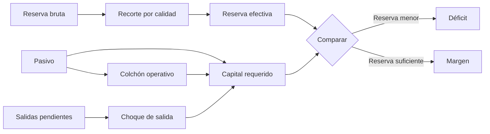
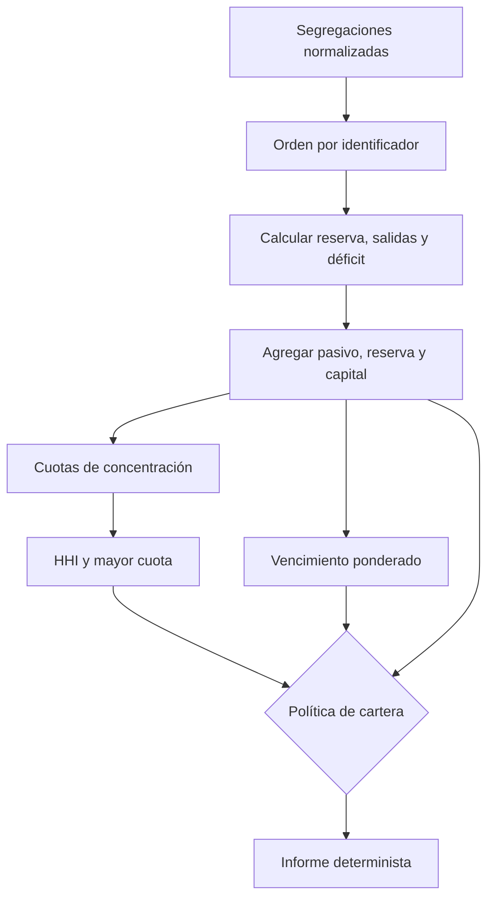
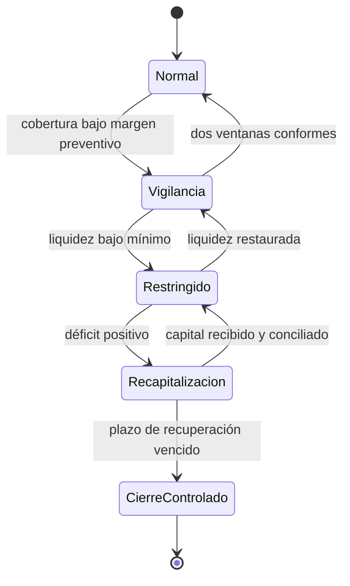

# Modelo económico y pruebas de estrés

## Unidades y redondeo

Las cantidades monetarias son enteros en la unidad mínima del activo. Los porcentajes se expresan en partes por millón (`PPM = 1_000_000`). CitadelDTL redondea de forma conservadora:

- reservas disponibles: hacia abajo;
- salidas estresadas: hacia arriba;
- costes operativos: hacia arriba;
- ratios informativos: hacia abajo.

No se usan números de coma flotante en las decisiones.

## Capital por segregación

Sea:

- \(L_i\): pasivo de custodia;
- \(R_i\): activos de reserva;
- \(O_i\): salidas pendientes;
- \(h_i\): recorte de reserva en PPM;
- \(s_i\): choque de salida en PPM;
- \(c_i\): coste operativo en PPM.

La reserva efectiva y las salidas bajo estrés son:

\[
R_i^{ef}=\left\lfloor\frac{R_i(10^6-h_i)}{10^6}\right\rfloor
\]

\[
O_i^{stress}=\left\lceil\frac{O_i(10^6+s_i)}{10^6}\right\rceil
\]

El capital requerido y el déficit son:

\[
C_i=L_i+O_i^{stress}+\left\lceil\frac{L_i c_i}{10^6}\right\rceil
\]

\[
D_i=\max(0,C_i-R_i^{ef})
\]

## Liquidez

La liquidez compara la parte realizable inmediatamente con las salidas estresadas:

\[
Q_i=\left\lfloor\frac{R_i^{liq}10^6}{O_i^{stress}}\right\rfloor
\]

Si no existen salidas y tampoco liquidez, el ratio se representa como cero. Si existen reservas líquidas y no existen salidas, el motor devuelve el máximo `uint64`; el consumidor debe mostrarlo como “sin restricción por salidas”, no como porcentaje literal.

## Concentración de cartera

La cuota de cada segregación es \(w_i=L_i/\sum_j L_j\). El índice agregado es:

\[
HHI=10^6\sum_i w_i^2
\]

Una cartera `60/40` produce `520_000 PPM`. Cuanto más próximo a `1_000_000`, mayor dependencia de una sola segregación. El vencimiento ponderado se calcula con los mismos pasivos:

\[
M=\left\lfloor\frac{\sum_i L_i m_i}{\sum_i L_i}\right\rfloor
\]

## Política de aceptación

Una evaluación es conforme solo si se cumplen simultáneamente:

1. déficit agregado igual a cero;
2. cobertura agregada mayor o igual al mínimo;
3. liquidez agregada mayor o igual al mínimo;
4. HHI menor o igual al máximo.

No se compensa un déficit local con exceso de otra segregación: el déficit total es la suma de déficits por segregación. Esto conserva el aislamiento jurídico y contable aunque la cobertura agregada parezca suficiente.

## Ejemplo de cartera

| Parámetro          |         EUR |         USD |
| ------------------ | ----------: | ----------: |
| Pasivo             |     400.000 |     600.000 |
| Reserva bruta      |     520.000 |     800.000 |
| Salidas pendientes |      40.000 |      50.000 |
| Reserva líquida    |     120.000 |     200.000 |
| Recorte            |  20.000 PPM |  10.000 PPM |
| Choque de salida   | 250.000 PPM | 200.000 PPM |
| Coste operativo    |   5.000 PPM |   5.000 PPM |
| Vencimiento        |    3 épocas |    7 épocas |

Resultados principales:

- reserva efectiva total: `1.301.600`;
- pasivo total: `1.000.000`;
- HHI: `520.000 PPM`;
- mayor concentración: `600.000 PPM`;
- vencimiento ponderado: `5 épocas`.

## Escalera de respuesta

La transición se decide con datos conciliados, no con una única lectura del servicio. Un cambio de umbral requiere gobernanza y debe conservar el cálculo anterior para comparación.

## Vectores de prueba mínimos

- producto intermedio mayor que `uint64`, con resultado final representable;
- resultado final fuera de rango, que debe terminar en error;
- salidas iguales a cero;
- reserva líquida mayor que reserva total, que debe rechazarse;
- identificadores duplicados;
- recorte exactamente `1_000_000 PPM`;
- costes y choques que requieren redondeo superior;
- carteras `100/0`, `50/50` y con múltiples segregaciones pequeñas.

Las pruebas Go constituyen la referencia. `computeCapitalMetrics` en TypeScript permite previsualizar una segregación y contiene vectores equivalentes para detectar divergencias de serialización o redondeo.
