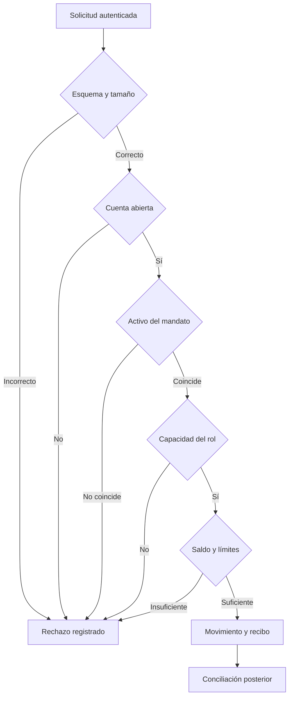
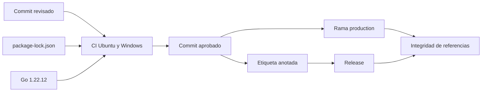
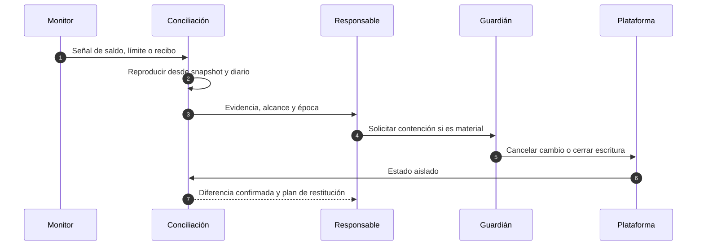

# Seguridad operativa

## Principios

La operación segura combina controles preventivos, detectivos y de recuperación. El servicio no debe recibir credenciales humanas, claves permanentes ni secretos en parámetros. Las identidades se resuelven en el borde y se transmiten como contexto autenticado.

## Matriz de responsabilidades

| Función      | Puede solicitar | Puede aprobar |  Puede ejecutar | Puede conciliar | Puede cancelar |
| ------------ | --------------: | ------------: | --------------: | --------------: | -------------: |
| Operaciones  |              Sí |            No |   Según mandato |              No |             No |
| Gobernador   |              Sí |            Sí | Sí, tras espera |              No |             No |
| Conciliación |              No |            No |              No |              Sí |             No |
| Guardián     |              No |            No |              No |         Lectura |             Sí |
| Plataforma   |      Despliegue |            No |              No |        Métricas |             No |

Las identidades de estas funciones deben ser distintas. Una persona puede asumir más de una función solo mediante elevación temporal registrada y aprobación externa.

## Flujo de autorización

La aplicación conserva razones de rechazo estables para automatización, pero el borde no debe exponer detalles que ayuden a enumerar cuentas o estados internos.

## Idempotencia

Cada escritura recibe una referencia de negocio y una clave idempotente de transporte. La referencia forma parte del evento; la clave se almacena junto con el hash canónico de la solicitud y su resultado.

Reglas para una implementación persistente:

1. La misma clave y el mismo hash devuelven el resultado anterior.
2. La misma clave con otro hash se rechaza como conflicto.
3. La reserva de la clave y el movimiento se confirman en una sola transacción.
4. El tiempo de retención cubre el máximo periodo de reintento de clientes y colas.
5. Una respuesta ambigua obliga al cliente a consultar el estado antes de reenviar.

## Gestión de secretos

- Usar un gestor de secretos y credenciales de corta duración.
- No registrar cabeceras de autorización, cookies ni cuerpos completos de escritura.
- Separar claves por entorno, servicio y función.
- Rotar con solapamiento: publicar nueva identidad, verificar, retirar la anterior.
- Probar revocación y recuperación al menos una vez por trimestre.

## Cadena de suministro

Los workflows tienen permisos de lectura por defecto. Cualquier permiso de escritura nuevo requiere justificación, revisión de propietario y alcance por trabajo. Las acciones se fijan a una versión mayor oficial y su actualización se revisa como cambio de plataforma.

## Protección ante abuso

- Límite de cuerpo antes de decodificar JSON.
- Métodos y rutas explícitos; no existe enrutado dinámico desde el usuario.
- Tiempo máximo de solicitud y de dependencia.
- Redirecciones desactivadas en el SDK.
- Lista de destinos autorizados para movimientos externos en el adaptador real.
- Cuotas por actor, cuenta, mandato y activo.
- Interruptor de escritura independiente de la disponibilidad de lectura.

## Detección y respuesta

La prioridad se determina por impacto económico máximo, alcance de cuentas, posibilidad de repetición y capacidad de contención. Una alerta sin diferencia reproducible permanece en investigación, no se descarta por ausencia de un único indicador.

## Lista previa a apertura de tráfico

- [ ] Commit de `main`, `production`, etiqueta y release idénticos.
- [ ] CI verde en ambos sistemas operativos.
- [ ] Parámetros de mandato y capital revisados por dos funciones.
- [ ] Secretos emitidos para el entorno y nunca copiados desde desarrollo.
- [ ] Snapshot inicial y reservas conciliados.
- [ ] Alertas, canal de guardia y procedimiento de cierre de escritura probados.
- [ ] Copia del diario accesible con identidad de solo lectura.
- [ ] Restauración ensayada con datos sintéticos recientes.

## Datos y privacidad

Los identificadores de cuenta del núcleo son referencias técnicas. La asociación con una entidad o persona debe residir en un sistema separado, cifrado y con retención propia. Los escenarios del repositorio contienen exclusivamente datos sintéticos.
