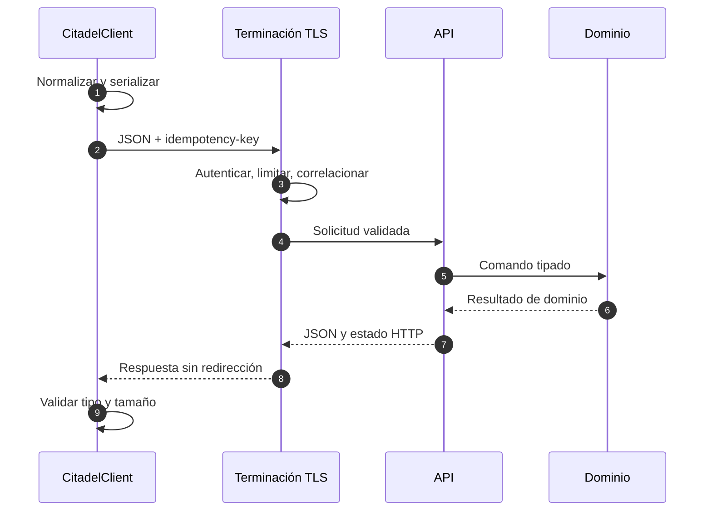
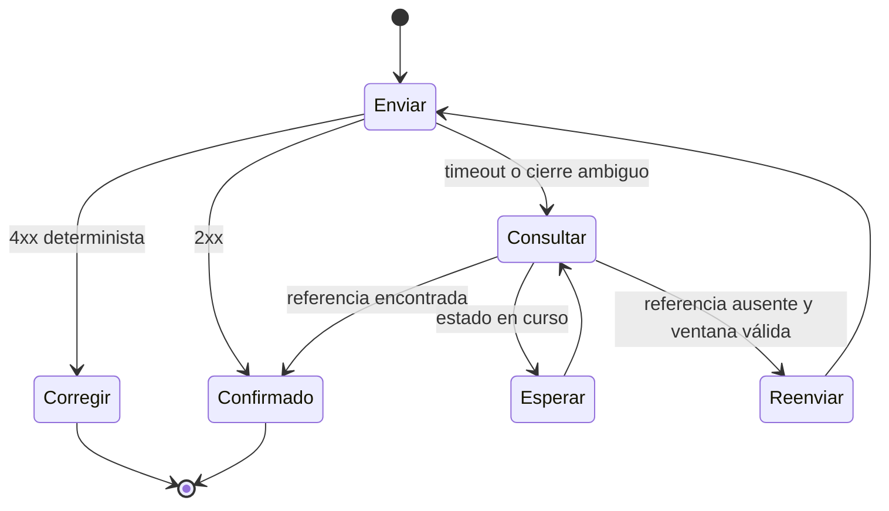

# API y SDK

## Contrato HTTP

La API incluida ofrece lectura de snapshot y ejecución de auditoría. Los métodos de escritura del SDK definen el contrato previsto para un adaptador de persistencia; deben conectarse solo cuando el despliegue disponga de autenticación, idempotencia durable y transacciones.

| Método | Ruta            | Finalidad                 | Idempotencia      |
| ------ | --------------- | ------------------------- | ----------------- |
| `GET`  | `/v1/snapshot`  | Estado conciliable actual | Natural           |
| `POST` | `/v1/audit`     | Evaluación de invariantes | Clave recomendada |
| `POST` | `/v1/mandates`  | Crear mandato             | Obligatoria       |
| `POST` | `/v1/transfers` | Mover saldo interno       | Obligatoria       |

## Flujo de solicitud



## Representación monetaria

Las cantidades viajan como cadenas decimales sin signo, separador ni exponente:

```json
{
  "amount": "25000",
  "asset": "USDC",
  "from": "operations-eu",
  "reference": "settlement-2026-08-001",
  "to": "settlement-usdc"
}
```

Una implementación HTTP no debe convertir `amount` a `number` en JavaScript. El límite seguro de IEEE-754 es insuficiente para agregados de custodia y cálculos intermedios.

## JSON canónico

`canonicalJSON` ordena claves de objeto de forma lexicográfica, conserva el orden de arrays y convierte `bigint` a decimal. `payloadHash` aplica SHA-256 sobre el UTF-8 resultante. El hash puede enlazarse a una aprobación de gobernanza o a un registro idempotente.

```ts
import { canonicalJSON, payloadHash } from "../sdk/citadelClient.ts";

const command = {
  target: "mandate-registry",
  method: "setDailyLimit",
  value: 250_000n,
};

const body = canonicalJSON(command);
const digest = payloadHash(command);
```

No se admite un `number` que no sea entero seguro. Los valores `undefined` deben eliminarse antes de firmar o guardar un hash para evitar contratos distintos entre lenguajes.

## Política del cliente

- HTTPS obligatorio salvo `localhost` habilitado explícitamente.
- URL base sin credenciales, consulta ni fragmento.
- Tiempo máximo entre `100 ms` y `60 s`.
- Respuesta entre `1 KiB` y `8 MiB`, según configuración.
- `redirect: error`, `credentials: omit` y `cache: no-store`.
- `Accept` y `Content-Type` fijados a `application/json`.
- cancelación propagada desde `AbortSignal`.
- error estructurado `CitadelHTTPError` para estados no exitosos.

## Estados HTTP recomendados

| Estado | Uso                                                          |
| -----: | ------------------------------------------------------------ |
|  `200` | Lectura o comando ya conocido                                |
|  `201` | Recurso creado                                               |
|  `202` | Operación aceptada para liquidación asíncrona                |
|  `400` | Esquema o cantidad inválidos                                 |
|  `401` | Identidad ausente o no verificable                           |
|  `403` | Identidad válida sin capacidad                               |
|  `404` | Recurso no visible para el actor                             |
|  `409` | Referencia repetida con carga distinta o estado incompatible |
|  `422` | Regla económica incumplida                                   |
|  `429` | Cuota agotada                                                |
|  `503` | Escritura cerrada o dependencia no disponible                |

## Reintentos



No se reintenta automáticamente un `POST` sin clave idempotente. Para `429` y `503`, el cliente respeta `Retry-After`, añade dispersión y mantiene la misma clave y cuerpo canónico.

## Compatibilidad

Los campos nuevos de respuesta deben ser opcionales para clientes anteriores. Eliminar, renombrar o cambiar la unidad de un campo requiere versión mayor. Una ruta nueva puede incorporarse en versión menor si no altera las existentes.

## Ejecución local

```bash
go run ./cmd/citadeldtl serve --address 127.0.0.1:8080
curl --fail --silent http://127.0.0.1:8080/v1/snapshot
```

El HTTP local sin cifrar se limita a la interfaz de bucle. En cualquier red compartida se exige terminación TLS autenticada.
