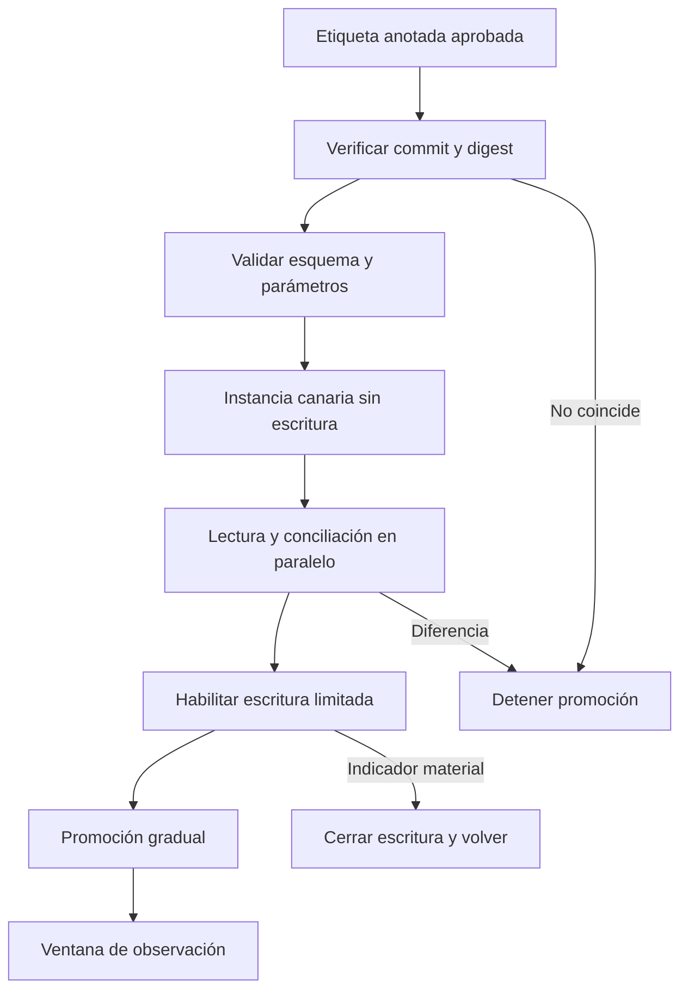
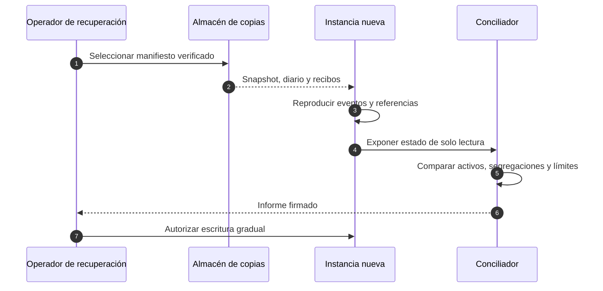

# Operación y recuperación

## Objetivos de servicio

| Indicador                   | Objetivo mensual | Ventana de medición |
| --------------------------- | ---------------: | ------------------: |
| Disponibilidad de lectura   |          99,95 % |           5 minutos |
| Disponibilidad de escritura |          99,90 % |           5 minutos |
| Latencia p95 de lectura     |         < 250 ms |          15 minutos |
| Latencia p95 de comando     |         < 750 ms |          15 minutos |
| Conciliaciones conformes    |            100 % |          Cada época |
| Retraso máximo del diario   |       < 2 épocas |            Continuo |

La disponibilidad no prevalece sobre la conservación. Si la aplicación no puede demostrar la versión de saldo o el presupuesto de un mandato, se cierra escritura y se mantiene lectura.

## Despliegue

### Preparación

1. Registrar commit, etiqueta, digest del artefacto y responsable.
2. Comparar parámetros efectivos con la propuesta de gobernanza.
3. Tomar snapshot y conciliación de reservas.
4. Confirmar acceso a diario, métricas, trazas y canal de guardia.
5. Probar cierre de escritura y cancelación de cambio.

### Promoción

La canaria empieza sin comandos. Tras dos conciliaciones iguales, se habilita una cuota reducida de escritura. El aumento de tráfico se detiene si aparece diferencia contable, incremento sostenido de rechazo o demora de recibos.

## Copias y restauración

Se conservan por separado:

- snapshot consistente de cuentas, saldos, mandatos y época;
- diario ordenado desde el punto de snapshot;
- recibos y referencias idempotentes;
- configuración y operaciones de gobernanza;
- manifiesto con hashes, versiones y hora.

La restauración carga el último snapshot verificado, reproduce el diario y compara el hash de estado. Después reconstruye el índice de idempotencia y consulta recibos externos pendientes. La escritura permanece cerrada hasta que los totales por activo y segregación coincidan.

## Guías de intervención

### Diferencia de reserva

1. Cerrar retiradas y liquidaciones del activo afectado.
2. Preservar snapshot, diario y fuente externa con marcas de tiempo.
3. Separar diferencia de valoración, demora de recibo y diferencia de cantidad.
4. Identificar la primera secuencia divergente.
5. Corregir mediante asiento explícito aprobado; nunca editar un evento anterior.
6. Repetir conciliación completa y mantener vigilancia reforzada dos ventanas.

### Saturación de límites

1. Confirmar que la época y el reloj son correctos.
2. Agrupar rechazos por mandato, actor, activo y referencia.
3. Distinguir demanda legítima de reintentos repetidos.
4. No elevar límites durante el incidente sin operación de gobernanza separada.
5. Reducir cuota en el borde si el patrón afecta disponibilidad.

### Recibo externo pendiente

1. Consultar por referencia, no emitir una referencia nueva.
2. Mantener el débito en estado reconciliable.
3. Si la contraparte confirma, completar el recibo con su identificador.
4. Si confirma ausencia, revertir mediante operación compensatoria registrada.
5. Escalar al vencer el objetivo de settlement.

## Reversión

Una reversión de binario no revierte datos. La versión anterior solo puede iniciar si comprende el esquema y los eventos ya escritos. Si no existe compatibilidad hacia atrás, se mantiene la versión nueva con escritura cerrada hasta aplicar una migración correctiva.

## Mantenimiento

- Semanal: dependencias, capacidad de disco, colas y caducidad de identidades.
- Mensual: restauración completa y comparación de hashes.
- Trimestral: simulación de guardián, rotación y pérdida de una zona.
- Por versión: prueba de migración y reversión con copia representativa sintética.

## Cierre de incidente

El cierre requiere línea temporal, causa, impacto máximo, cuentas y activos afectados, reconciliación final, acciones con responsable y fecha, y evidencia de que el control añadido funciona. Las métricas de negocio se revisan para detectar efectos secundarios de la contención.
