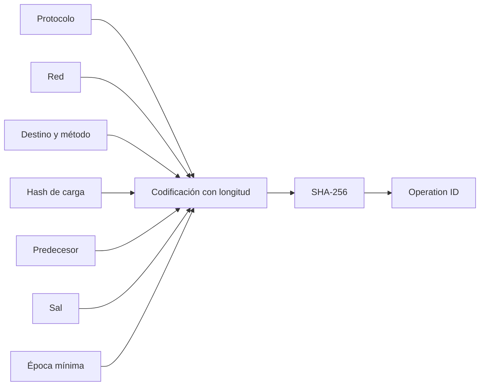
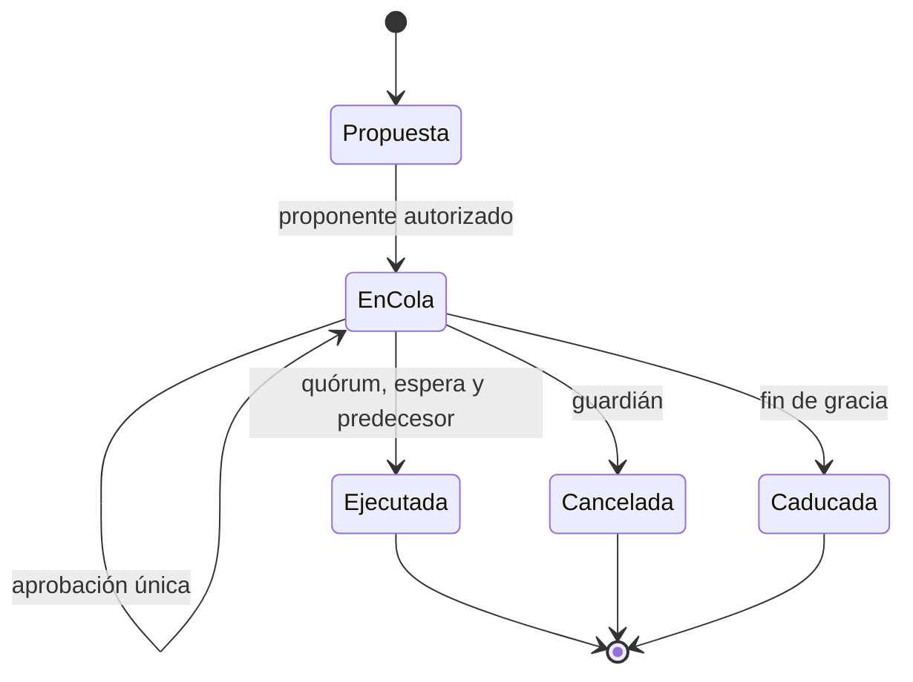

# Gobernanza y gestión de cambios

## Identidad de operación

Una operación contiene protocolo, red, destino, método, hash de carga, predecesor, sal y época mínima. `OperationID` codifica cada cadena con longitud de 64 bits en orden de red, añade la época como entero de 64 bits y aplica SHA-256.

Esta codificación evita ambigüedades de concatenación: `ab|c` y `a|bc` producen secuencias distintas. Los hashes hexadecimales se normalizan a minúsculas antes de calcular la identidad.



## Ciclo de vida



El proponente aporta la primera aprobación al encolar. Una identidad no puede aprobar dos veces. La ejecución requiere identidad gobernadora activa, quórum, época igual o posterior a `ExecuteAfter`, época no posterior a `ExpiresAt` y predecesor ejecutado cuando exista.

## Separación de cambios

No se agrupan en una sola carga:

- actualización de binario;
- cambio de límite económico;
- alta o baja de identidad;
- cambio de destino externo;
- modificación del tiempo de espera;
- acción de recuperación.

Separar las operaciones permite cancelar una parte, aplicar predecesores y atribuir cada aprobación a un efecto concreto.

## Ejemplo Go

```go
executor, err := governance.NewExecutor(
    []string{"gov-a", "gov-b", "gov-c"},
    2,
    24,
    48,
    "guardian",
)
if err != nil {
    return err
}

operation := governance.Operation{
    Protocol:     "CitadelDTL",
    Network:      "institutional-1",
    Target:       "mandate-registry",
    Method:       "setDailyLimit",
    PayloadHash:  payloadDigest,
    Salt:         "change-2026-08",
    ExecuteAfter: currentEpoch + 24,
}

record, err := executor.Queue(operation, "gov-a", currentEpoch)
```

## Política recomendada

| Clase                  |   Quórum | Espera mínima |    Gracia | Revisión adicional |
| ---------------------- | -------: | ------------: | --------: | ------------------ |
| Operativa reversible   |      2/3 |     24 épocas | 48 épocas | Operaciones        |
| Límite económico       |      3/5 |     72 épocas | 48 épocas | Riesgo             |
| Identidad o destino    |      4/5 |     96 épocas | 24 épocas | Seguridad          |
| Emergencia restrictiva | Guardián |     Inmediata | No aplica | Revisión posterior |

El guardián solo cancela operaciones en cola o activa controles restrictivos en la infraestructura externa. No puede saltar el quórum para ampliar límites o mover fondos.

## Revisión de propuesta

Cada propuesta debe incluir:

1. valor actual y valor propuesto;
2. unidad, rango y redondeo;
3. cuentas, activos y redes afectadas;
4. simulación con escenarios normales y extremos;
5. plan de observación y criterio de reversión;
6. hash canónico de la carga;
7. predecesores y dependencias.

## Custodia de aprobaciones

Las claves gobernadoras deben usar dispositivos o servicios distintos y políticas de firma independientes. La interfaz de aprobación muestra todos los campos enlazados, no solo un resumen libre. La sal debe ser única para impedir que dos propuestas conceptualmente distintas compartan identidad.

## Auditoría

`Records()` devuelve copias ordenadas por identificador. Un exportador persistente añade actor, hora observada, resultado y comprobación del hash de carga. Las aprobaciones no se eliminan al ejecutar o cancelar; forman parte de la evidencia de cambio.
