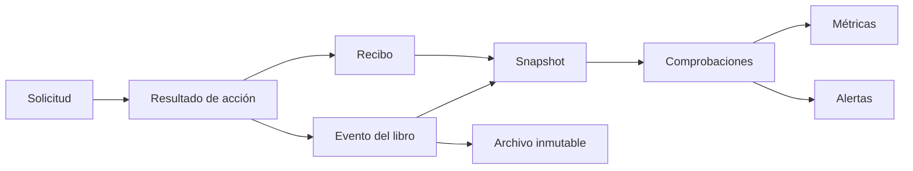
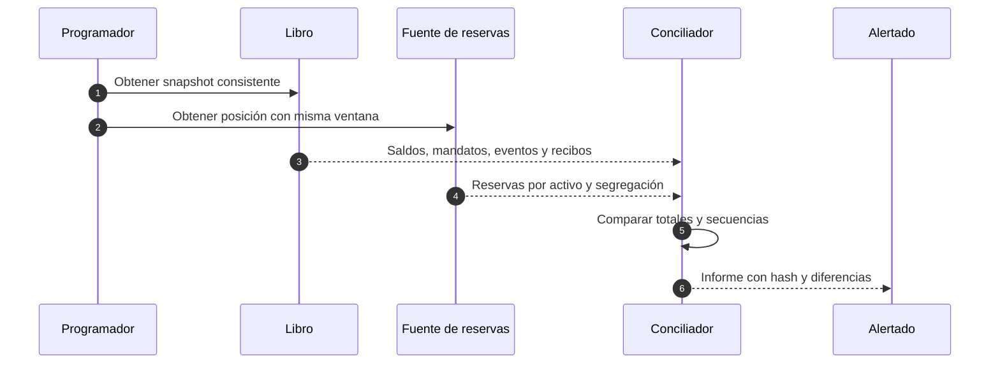

# Observabilidad y conciliación

## Señales esenciales

La telemetría debe permitir responder: qué se solicitó, qué política decidió, qué saldo cambió, qué recibo se emitió y si el estado agregado conserva sus propiedades. Los identificadores de correlación no contienen información personal.

## Flujo de evidencia

## Campos de registro

| Campo            | Ejemplo                  | Observación                         |
| ---------------- | ------------------------ | ----------------------------------- |
| `correlation_id` | `corr-01J...`            | Generado en el borde                |
| `reference`      | `settlement-2026-08-001` | Clave de negocio                    |
| `action_type`    | `withdraw`               | Enumeración estable                 |
| `actor_id`       | `service-operations-eu`  | Identidad técnica                   |
| `account_id`     | `operations-eu`          | Sin datos personales                |
| `mandate_id`     | `mandate-eu-01`          | Cuando corresponda                  |
| `asset`          | `USDC`                   | Activo normalizado                  |
| `amount`         | `25000`                  | Cadena decimal                      |
| `decision`       | `accepted`               | Estado de dominio                   |
| `reason`         | `limit.daily_exceeded`   | Código estable                      |
| `receipt_id`     | `receipt-000001`         | Movimiento externo                  |
| `epoch`          | `1842`                   | Reloj económico                     |
| `state_version`  | `98122`                  | Control de concurrencia persistente |

No se registran tokens, cabeceras de autorización, cargas completas ni destinos externos sin seudonimización.

## Métricas

### Tráfico y decisión

- comandos por tipo, activo y estado;
- latencia p50, p95 y p99;
- rechazos por razón estable;
- reintentos y conflictos de idempotencia;
- cola y edad de recibos pendientes.

### Estado económico

- pasivo y reserva efectiva por segregación;
- déficit y cobertura en PPM;
- liquidez en PPM;
- HHI y mayor cuota;
- consumo y capacidad restante por mandato;
- fondos externos emitidos por época.

### Plataforma

- saturación de CPU, memoria, conexiones y almacenamiento;
- retraso del diario y del conciliador;
- errores de dependencia y estado del interruptor de escritura;
- versión, commit y hash de configuración activos.

## Conciliación

El informe contiene periodo, versiones de ambas fuentes, totales, diferencias, primera secuencia divergente y hash del contenido. Repetir el proceso con las mismas entradas produce el mismo resultado ordenado.

## Niveles de alerta

| Nivel       | Condición orientativa                                            | Acción                               |
| ----------- | ---------------------------------------------------------------- | ------------------------------------ |
| Informativa | Exceso de reserva o cambio previsto                              | Registrar y revisar tendencia        |
| Advertencia | Retraso de conciliación o saldo en cuenta suspendida             | Intervención en horario de guardia   |
| Alta        | Capacidad operativa inesperada o uso anómalo                     | Revisar y limitar circuito           |
| Crítica     | Déficit, conservación incumplida o recibo material no conciliado | Cerrar escritura y activar incidente |

Una alerta económica crítica no depende de un promedio: una sola segregación con déficit es suficiente.

## Objetivos de alertado

- Tiempo de detección: una época o menos para diferencias contables.
- Tiempo de notificación: menos de cinco minutos tras confirmar la diferencia.
- Cobertura: cada activo y segregación activos.
- Calidad: todos los avisos incluyen referencia de informe y procedimiento.

## Panel mínimo

El panel operativo presenta en este orden:

1. estado de escritura, versión y última conciliación;
2. pasivo, reserva, cobertura, liquidez y déficit por activo;
3. segregaciones ordenadas por déficit y concentración;
4. consumo de mandatos y rechazos;
5. recibos pendientes por antigüedad;
6. cambios de gobernanza en cola y tiempo restante.

## Retención

Las métricas agregadas pueden compactarse. Los eventos contables, recibos, referencias y registros de gobernanza conservan la retención exigida por la política de custodia y se almacenan con integridad verificable. El acceso queda registrado y separado del plano de escritura.
